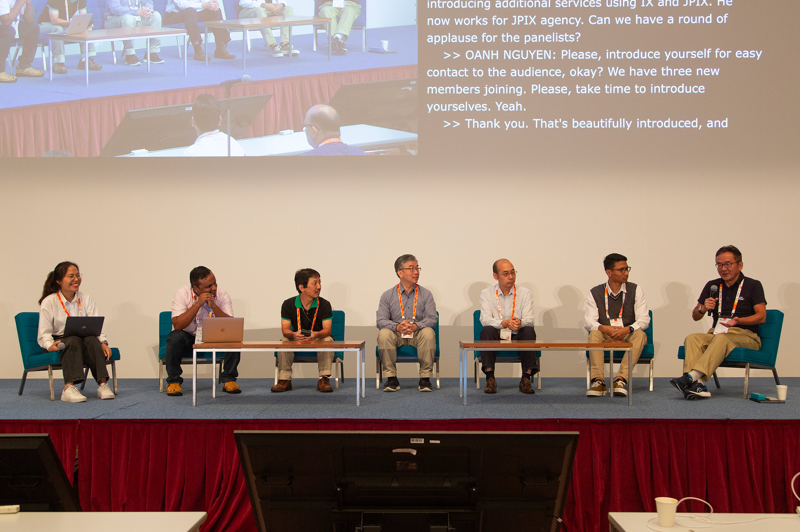
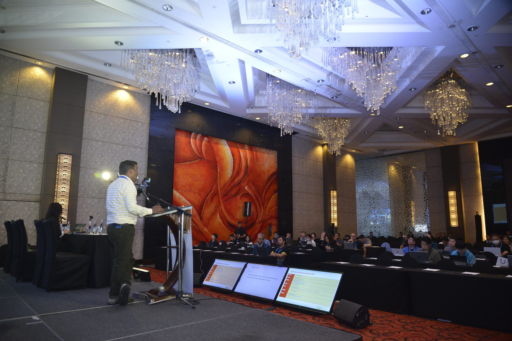

# My personal website

Gaurav Kansal is a Joint Director (IT) at the National Informatics Centre. During his tenure at NIC, he has worked on multiple technologies and handled important projects including National Knowledge Network (NKN), IPv6 implementation across NICNET, Setting up ANYCAST DNS Services, and wireless services across the NICNET. Currently, he is the technical lead of the 1.10.10.10 Public DNS Project for the Indian IP Space, with an aim of improving the cyber posture of the country.

# Interest and Skill Sets
* Wired and Wireless Networks
* IP Protocol (IPv4 and IPv6) 
* Domain Name System 
* Writing technical blogs 
* Co-authored the following handbooks - *TUNE INTO WLC* (ISBN No - 978-93-5419-656-0 and Copyright No L-97828/2020) and *AN INTRODUCTION TO CYBER THREAT INTELLIGENCE* (ISBN No - 978-93-5419-269-2 and Copyright No L-98405/2021)

# Affiliations
* Member of [Address Supporting Organization](https://icannwiki.org/Address_Supporting_Organization) (tenure 01.Jan.2023 to 31.Dec.2024)
* Co-Chair APNIC NIR SIG (tenure APNIC 54 - APNIC 58)
* Member of RSSAC Caucus
* RIPE Atlas Ambassador
* ICANN Wiki Ambassador
* ICANN [Fellowship Selection Committee Member](https://icannwiki.org/ICANN_Fellowship_Program#Fellowship_Selection_Committee) (ICANN 78 onwards)
